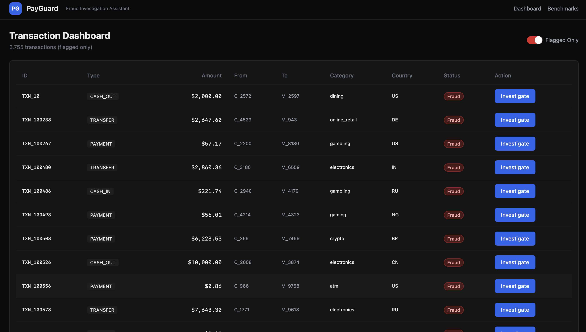
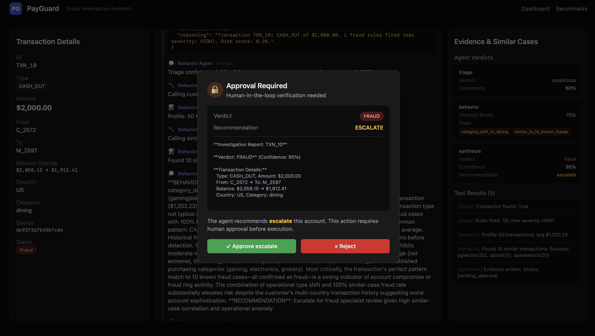
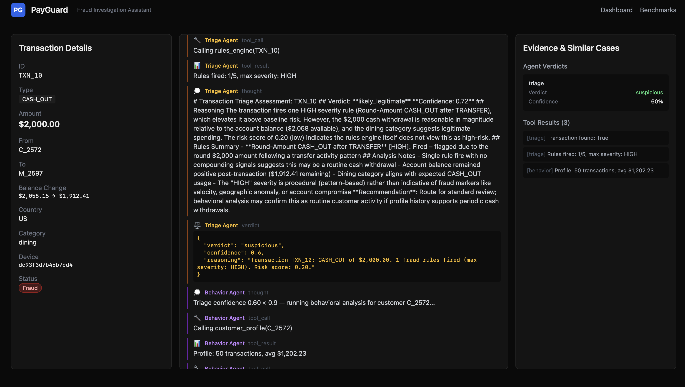
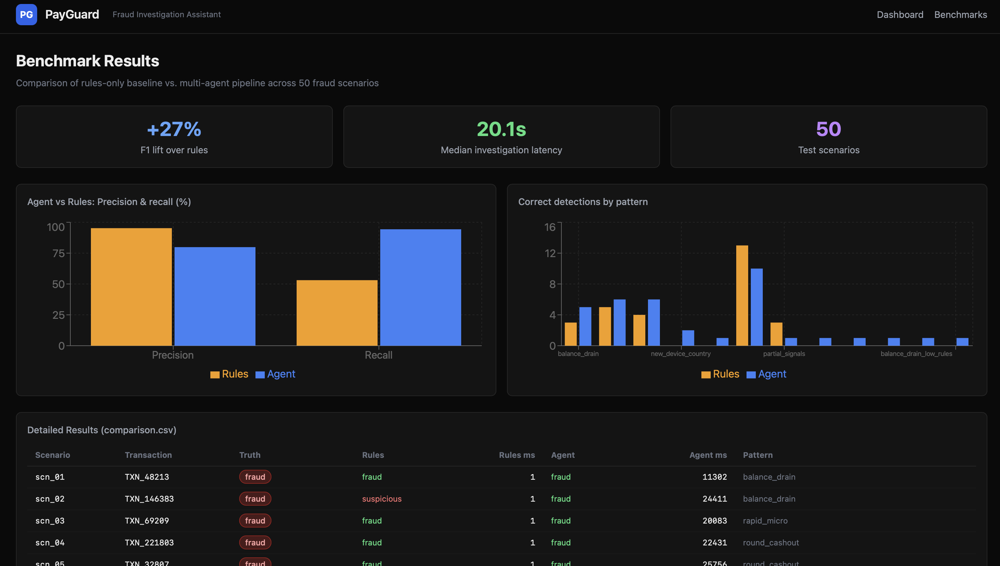

# PayGuard

LLM-powered payment fraud investigation assistant. Multi-agent reasoning, hybrid retrieval, and human-in-the-loop approval gates for analyst-grade fraud triage.

   

## What it does

Fraud operations teams face two problems that work against each other. Rules engines are fast and explainable but miss novel adversarial patterns. Manual analyst review catches nuance but is slow and expensive. PayGuard is a middle layer: a multi-agent pipeline that investigates suspicious transactions the way a human analyst would (triage the signal, check behavior against history, synthesize evidence), then routes the decision to a human for any high-severity action.

Each investigation runs three specialist agents in sequence: a Haiku-powered triage agent that flags obvious cases quickly, a Sonnet behavior agent that reasons over customer history and similar past frauds, and a Sonnet synthesis agent that produces a calibrated verdict with audit-grade reasoning. When the synthesis recommends an account freeze or escalation, the request pauses at an approval gate for analyst sign-off before any action persists.

## Why this approach

**Multi-agent over monolithic.** Separating triage, behavior, and synthesis lets each agent run against a scoped toolset and a role-specific prompt. Triage runs on Haiku (5x cheaper, sub-3s) for the 40% of cases with clear signals; Sonnet only engages when the case warrants deeper reasoning. The separation also makes failure modes debuggable: a bad verdict can be traced to the specific agent and tool call that produced it.

**Hybrid retrieval over single-store.** No single retrieval system handles all fraud queries well. pgvector keeps embeddings transactionally consistent with the operational database. Qdrant handles filtered ANN at scale. OpenSearch provides BM25 plus aggregations for structured event analysis. Results fuse via reciprocal rank fusion (RRF) to cover semantic, filtered, and keyword retrieval in a single query.

**Human-in-the-loop over auto-block.** In fraud ops, false negatives (missed fraud) cost orders of magnitude more than false positives (analyst review time). PayGuard is tuned for high recall and routes borderline or high-severity cases to a human before any irreversible action. The approval gate is non-optional for freeze and escalate recommendations.

**Out of scope by design:** real-time auto-decline, PCI-grade production hardening, and replacing existing rules engines. PayGuard augments analysts; it does not replace policy engines, real-time blocking, or payment network controls. The dataset is synthetic (PaySim-inspired); labels support benchmarking, not regulatory filing.

## Architecture


```
                      +-------------------+
                      | Next.js /         |
                      | Streamlit UI      |
                      +---------+---------+
                                | REST / SSE / GraphQL
                                v
   +-----------------------------------------------------------+
   |                    FastAPI API                            |
   |                                                           |
   |   +--------+   conditional   +----------+                 |
   |   | Triage |--(may skip)---->| Behavior |                 |
   |   +---+----+                 +-----+----+                 |
   |       |                            |                      |
   |       +------------+---------------+                      |
   |                    v                                      |
   |              +-----+-----+                                |
   |              | Synthesis |                                |
   |              +-----+-----+                                |
   |                    |                                      |
   |          approval gate (freeze/escalate)                  |
   |                    v                                      |
   |      evidence + audit log (Postgres)                      |
   +-----------------------------------------------------------+
              |              |              |
              v              v              v
        PostgreSQL        Qdrant       OpenSearch
        + pgvector
```

Components:

- **Triage Agent** (Claude Haiku 4.5): transaction lookup plus rules engine. Terminates with high-confidence legitimate or fraud when signals are clear; otherwise hands off to behavior.
- **Behavior Agent** (Claude Sonnet 4.5): customer profile lookup plus hybrid similar-fraud search across pgvector, Qdrant, and OpenSearch with RRF fusion.
- **Synthesis Agent** (Claude Sonnet 4.5): combines triage and behavior evidence via a calibrated fraud-score function with an adversarial pattern override for multi-dimensional signal stacking. Writes the final verdict and evidence to Postgres.
- **Approval Gate**: SSE-driven human checkpoint before any freeze or escalate persists. Decisions are written to the audit log.
- **5 MCP Tool Servers** (REST + GraphQL): transaction_lookup, customer_profile, similar_fraud_search, rules_engine, evidence_writer.
- **Audit Log**: every state transition records actor, timestamp, prior and new state. Supports forensic replay.

## Demo



Investigation with streaming agent reasoning and human-in-the-loop approval gate:





Benchmarks page comparing rules-only baseline vs the multi-agent pipeline across 50 scenarios:



## Tech stack

| Layer | Technology |
|---|---|
| Backend | FastAPI, LangGraph, Strawberry GraphQL, Claude Agent SDK, Uvicorn, SQLAlchemy async |
| LLMs | Claude Sonnet 4.5 (behavior, synthesis); Claude Haiku 4.5 (triage) |
| Storage | PostgreSQL + pgvector, Qdrant, OpenSearch |
| Frontend | Next.js 14 (App Router), Tailwind CSS, shadcn/ui |
| Backup UI | Streamlit |
| Infrastructure | Docker Compose, Makefile automation |
| Observability | Structured audit logging, per-investigation cost tracking, model breakdown per agent call |

## Quick start

Prerequisites: Docker Desktop, an Anthropic API key.

```bash
cp .env.example .env      # set ANTHROPIC_API_KEY, keep MOCK_LLM=0 for real models
make demo                 # builds images, seeds 250K rows, starts UI + API, runs benchmark
```

`make demo` waits for Postgres, Qdrant, and OpenSearch to be healthy, seeds ~250K synthetic transactions with embeddings across all three stores, boots the API and both frontends, and prints service URLs. For deterministic offline demos without an API key, set `MOCK_LLM=1` to route through canned traces.

## Benchmark results

Numbers below are from the most recent run in `benchmarks/results/summary.json` (50 scenarios, live API, `MOCK_LLM=0`).

| Metric | Rules-only baseline | Multi-agent pipeline |
|---|---|---|
| **F1** | 0.682 | **0.865** |
| Precision | 0.952 | 0.799 |
| Recall | 0.531 | **0.943** |
| Adversarial patterns caught | 2 / 5 | **5 / 5** |
| Ambiguous accuracy | 30% | 10% |
| Median latency | 1 ms | 20.1 s |

**Headline:** +27% F1 lift over rules, caught all 5 adversarial patterns vs 2 for rules, at a median 20-second latency trade.

**Trade-offs in these numbers:**

- The agent accepts lower precision (80% vs 95%) in exchange for far higher recall (94% vs 53%). This matches fraud ops economics where missing fraud is much costlier than flagging a legitimate transaction for human review.
- Agent ambiguous accuracy is lower than rules. The agent is tuned to route ambiguous cases to the approval gate rather than force-classify. The "correct" answer for an analyst-facing tool is "send this to a human," which this benchmark scores against "suspicious."
- Latency is ~20x rules because each investigation chains triage → behavior → synthesis plus tool calls. For real-time use, a separate fast-path would be needed; this pipeline targets analyst workflows where human review is the bottleneck, not model inference.

Reproduce:

```bash
make bench               # or: docker compose run --rm worker python -m benchmarks.run_benchmark
```

Runtime: 15-25 minutes. Cost: ~$1 in Anthropic API usage.

## Agents and tools

| Agent | Model | Role |
|---|---|---|
| Triage | Haiku 4.5 | Rules + transaction lookup; fast path for clear cases |
| Behavior | Sonnet 4.5 | Customer profile + hybrid similar-fraud retrieval |
| Synthesis | Sonnet 4.5 | Fraud-score calibration + adversarial override; writes evidence |

| Tool | Purpose |
|---|---|
| transaction_lookup | Fetch transaction row from Postgres |
| customer_profile | Aggregate customer history (30-day avg, category distribution, device/country baseline) |
| similar_fraud_search | Hybrid ANN+BM25 retrieval across pgvector, Qdrant, OpenSearch with RRF fusion |
| rules_engine | Deterministic rule evaluation with severity levels |
| evidence_writer | Persist investigation row plus cost and confidence |

All tools are exposed as in-process MCP servers via the Claude Agent SDK and also as REST and GraphQL endpoints.

## Development

```bash
make test    # dockerized pytest smoke suite
make lint    # ruff + black --check (backend + benchmarks)
make format  # black + ruff --fix + prettier
```

Local Python (without Docker):

```bash
cd backend && pip install ruff black pytest && ruff check . && black . && python -m pytest tests/ -v
```

## Trade-offs and known limitations

- **Synthetic data.** PaySim-inspired generation with injected fraud patterns. Not a substitute for real production fraud labels with class imbalance, adversarial drift, and rare-event dynamics.
- **Single-transaction scope.** Investigations operate on one transaction row plus aggregate customer profile plus retrieval. Sequence-based fraud (slow-drip drains, rolling-window laundering, 60-day behavioral shifts) is not modeled. See `DECISIONS.md` for the adversarial benchmark redesign note.
- **Demo throughput.** Sequential investigation execution, no horizontal worker pool. Production would require a queue-based worker fleet with Celery or Temporal.
- **Approval gate is single-role.** No RBAC, SSO, or role-based routing. All approvals go to one pool.
- **No prompt caching.** Anthropic prompt caching would cut input tokens ~90% on repeated system prompts. Not implemented in this version.
- **Rules baseline is intentionally simple** so the agent vs rules comparison is meaningful on novel patterns rather than a rules-engineering competition.

## What I would build next

Priority-ordered roadmap for v2.

**Security and compliance (near-term).**
SOC2-aligned controls: OIDC SSO with role-based access control (analyst, supervisor, auditor tiers) on the approval gate; encryption at rest for audit logs and investigation evidence; secrets management via Vault or AWS KMS instead of environment variables; structured audit events exported to a SIEM-compatible store; per-tenant data isolation for multi-customer deployment; PII redaction in LLM prompts.

**Multi-transaction and sequence fraud.**
Rolling-window aggregation over transaction streams (Flink or Kafka Streams) to detect slow-drip drains, merchant collusion chains, and synthetic-identity behavioral drift that single-transaction analysis cannot see. Feature store (Feast or Tecton) feeding both rules and behavior agent.

**Shadow-mode evaluation and drift detection.**
Ship new agent prompts and retrieval changes in shadow mode against a frozen golden scenario set. Auto-promote only when agreement stays above 95% on a labeled holdout. Weekly drift reports comparing this week's verdicts against baseline distributions.

**Observability.**
OpenTelemetry traces across agents with correlation IDs, per-agent latency and error histograms in Prometheus, Grafana dashboards for cost per investigation and token usage, alert rules on F1 regression or cost anomalies.

**Broader risk and compliance assist.**
Extend the same agent architecture beyond fraud detection to related analyst workflows: AML transaction review, sanctions screening triage, chargeback investigation. Same MCP tool contracts, different agent prompts and reference data. Not a pivot away from fraud, an expansion of the investigation mandate.

**Public dataset adapters.**
Optional adapters behind the same tool contracts for IEEE-CIS and Kaggle fraud datasets so the pipeline can be evaluated on public labeled data without changing the agent code.

**Prompt caching and cost controls.**
Anthropic prompt caching on triage and synthesis system prompts. Per-tenant spend budget with circuit breaker. Haiku-only mode for off-hours when analyst coverage is lower.

## Project structure

```
payguard/
├── backend/              # FastAPI API, LangGraph agents, MCP tool servers
│   └── app/
│       ├── agents/       # triage, behavior, synthesis with prompts
│       ├── retrieval/    # pgvector, Qdrant, OpenSearch, RRF fusion
│       └── mcp_servers/  # 5 tool servers (REST + GraphQL)
├── frontend/             # Next.js 14 investigation console
├── streamlit_app/        # Streamlit backup UI
├── benchmarks/           # 50-scenario benchmark harness + rules baseline
├── data/                 # Synthetic data generator + fraud scenarios
├── docs/images/          # README screenshots
├── docker-compose.yml    # postgres, qdrant, opensearch, api, worker, ui, streamlit
├── Makefile              # demo, bench, test, lint, format
└── DECISIONS.md          # Design decisions and trade-off log
```

## License

MIT. See [LICENSE](LICENSE).